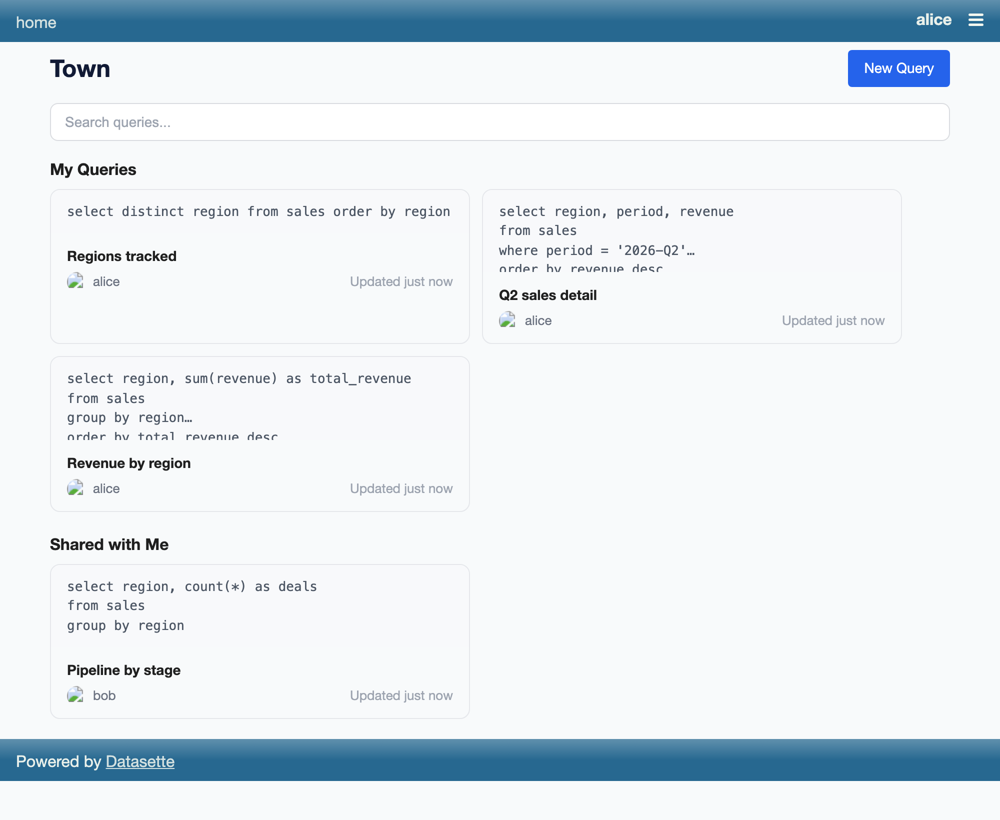
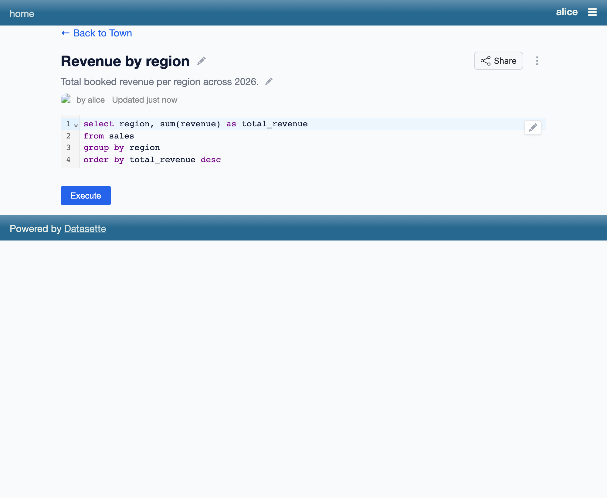
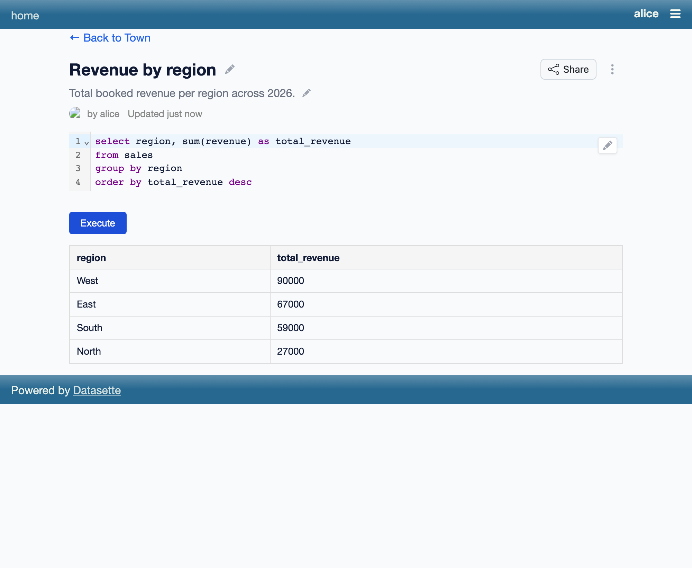
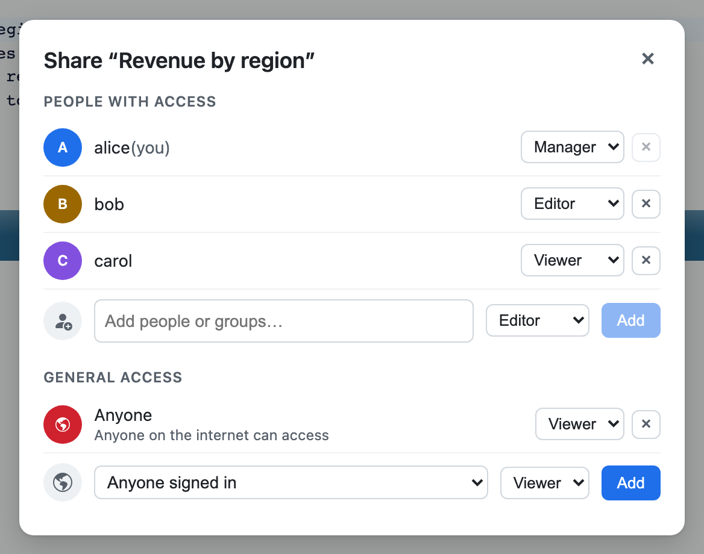
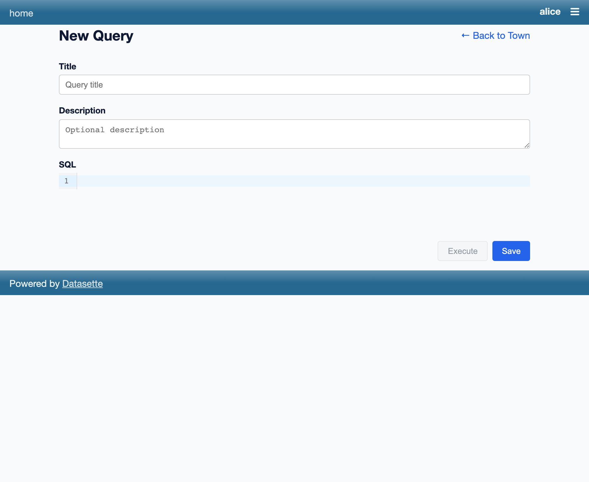

# datasette-town

[](https://pypi.org/project/datasette-town/)
[](https://github.com/datasette/datasette-town/releases)
[](https://github.com/datasette/datasette-town/actions/workflows/test.yml)
[](https://github.com/datasette/datasette-town/blob/main/LICENSE)

Experimental plugin for sharing SQL queries

## Screenshots

Browse and search the queries you own and ones shared with you:



Open a query to view its SQL, run it, and (if you own it) share it:





Sharing is handled by [datasette-acl](https://github.com/datasette/datasette-acl)
via the `<datasette-acl-share-dialog>` component — share with people, groups, or
the public:



Write a new query with a live SQL editor:



The committed screenshots are regenerated with `just shots` (see the `shots`
recipe in the [Justfile](Justfile)).

## Permissions and sharing

Access to individual queries is managed by
[datasette-acl](https://github.com/datasette/datasette-acl), with sharing UI
provided by
[datasette-acl-share](https://github.com/datasette/datasette-acl-share) (both
hard dependencies).

Each query is an acl resource of type `town-query`, addressed as
`(parent=database_name, child=query_id)`. The creator is seeded the **Manager**
role; the standard Viewer / Editor / Manager roles map to the `datasette-town-view`,
`datasette-town-edit`, and `datasette-town-manage` actions. The query detail page
hosts the `<datasette-acl-share-dialog>` component, which is how queries are shared
with people, groups, or the public — making a query public is an `everyone` (or
`authenticated`) grant rather than a flag on the query.

Two coarse, instance-level gates are configured through Datasette's normal
permissions config:

- `datasette-town-access` — can use the town feature at all
- `datasette-town-create` — can create new queries

```yaml
permissions:
  datasette-town-access:
    id: "*"
  datasette-town-create:
    id: "*"
```